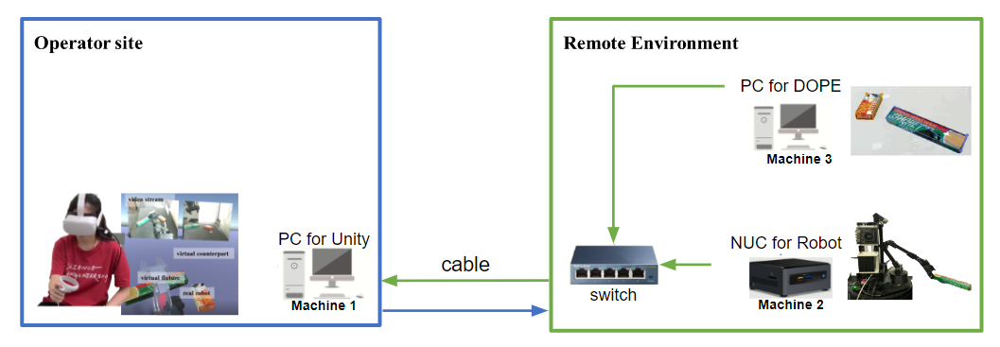
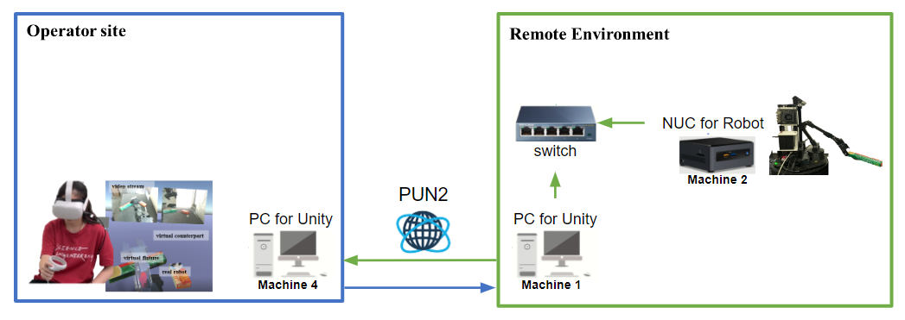
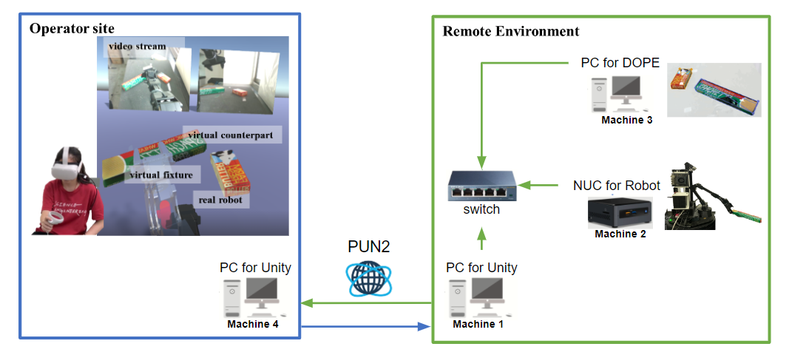

# WFH_locobot
A public version for WFH-VR teleoperation system (Robot : LoCoBot)

This system is used in this paper 

[WFH-VR: Teleoperating a Robot Arm to set a Dining Table across the Globe via Virtual Reality](https://ieeexplore.ieee.org/stamp/stamp.jsp?tp=&arnumber=9981729)

```
@INPROCEEDINGS{9981729,
  author={Yim, Lai Sum and Vo, Quang TN and Huang, Ching-I and Wang, Chi-Ruei and McQueary, Wren and Wang, Hsueh-Cheng and Huang, Haikun and Yu, Lap-Fai},
  booktitle={2022 IEEE/RSJ International Conference on Intelligent Robots and Systems (IROS)}, 
  title={WFH-VR: Teleoperating a Robot Arm to set a Dining Table across the Globe via Virtual Reality}, 
  year={2022},
  volume={},
  number={},
  pages={4927-4934},
  doi={10.1109/IROS47612.2022.9981729}}
```

# Basic requirement 
Robot : LoCoBot

VR device : Oculus quest 2

Unity version : 2020.3.36

Unity package : 
- XR interaction Toolkit (version : 2.0.2)
- RosSharp 
- PUN2
- Animation Rigging
- Final-ik 


# Usage 

You could follow the following instrunction: 

## Teleoperation

1. Download WFH-VR unity package from this repo. [Link](https://github.com/yimlaisum2014/vr_navi_mani_unity)
2. Create a New Unity Project
3. Import WFH-VR unity package
4. Choose the scense fit your network setup and the feature

    - [[Tutorial Link](Tutorial/P_Local_w_VS.md)] Local mode : wired ethernet connection with VR-VS mode 
    
    - [[Tutorial Link](Tutorial/P_Local_w_3DO.md)] Local mode : wired ethernet connection with VR-3DO mode (pose-estimation by DOPE) 
    
    - [[Tutorial Link](Tutorial/P_Global_w_VS.md)] Glocal mode : PUN2 cloud framework with VR-VS mode 
    
    - [[Tutorial Link](Tutorial/P_Global_w_3DO.md)] Glocal mode : PUN2 cloud framework with VR-3DO mode (pose-estimation by DOPE) 
    

## Record the trajectory

1. Recommand you should record bag first
```
$ source record_vr.sh
```

2. Launch a file for listening tf from /base_link /gripper_link
```
$ roslaunch locobot_trajectory_log new_locobot_trajectory_log.launch
```

3. Save and Stop recoring as csv. file 

```
$ rosservice call /start_record 
$ rosservice call /stop_record 
```
