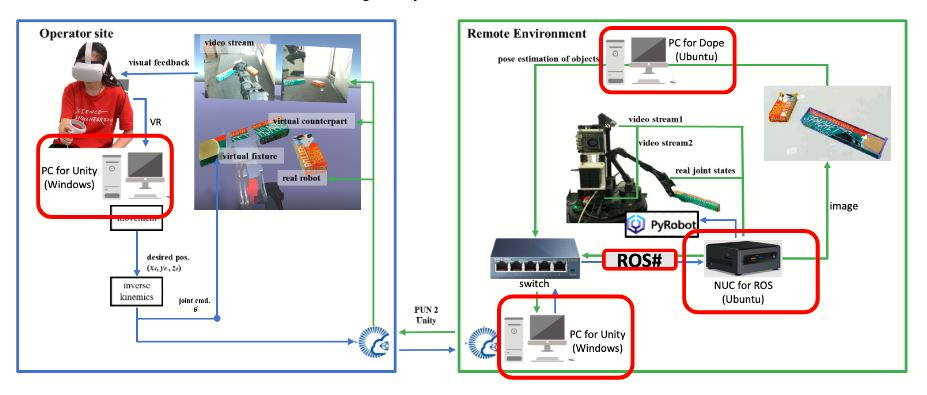

# How to setup and run WFH-locobot system


**Computing Unit** :

1. Local mode : Intranet connected
   - with GPU for prediction [ROS_ip : 10.42.0.4]
   - NUC [ROS_ip : 10.42.0.2]
   - with Windows OS for running Unity [ROS_ip : 10.42.0.3]

2. Globle mode : Internet (with  PUN2 connected)
   - with Windows OS for running Unity


## A. Dope Setup
### On GPU machine
1. Clone repo

```bash
mkdir -p ~/catkin_ws/src
cd ~/catkin_ws/src
git clone https://github.com/yimlaisum2014/Deep-Object-Pose.git dope
cd dope/
git checkout devel-exp
```

2. Pull Docker

``` bash
docker pull yimlaisum2014/dope:gpu-noetic
```

3. Enter Docker and make&source workspace

```bash
source docker_run.sh
cd /home/catkin_ws/
catkin_make
source devel/setup.bash
```

4. Launch Dope

Put weight in the ~/catkin_ws/src/dope
```bash
roslaunch dope dope.launch
```

## B. Locobot Setup

### On NUC (locobot)

### 1. Clone repo

```bash
mkdir -p ~/catkin_ws/src
cd ~/catkin_ws/src
git clone git@github.com:ARG-NCTU/WFH_locobot.git
```

###  2. Pull Docker

``` bash
docker pull yimlaisum2014/locobot:NUC-vr-py2
```

###  3. RUN WFH-system

#### Step[1] : Terminal 1 (build and launch roswebsocket)

```bash
NUC $ cd WFH_locobot/Docker/NUC/vr
NUC $ source docker_run.sh
Docker $ cd WFH_locobot
Docker $ source catkin_make_py2.sh
Docker $ source set_ip.sh
Docker $roslaunch rosbridge_server rosbridge_websocket.launch
```

#### Step[2] :Terminal 2 (start locobot)

```bash
NUC $ cd WFH_locobot/Docker/NUC/vr
NUC $ source docker_join.sh
Docker $ cd GMU_NCTU_Unity_ROS
Docker $ source set_ip.sh
Docker $ source run_locobot.sh
```

#### Step[3] :Terminal 3 (run vr control robot arm script)

```bash
NUC $ cd WFH_locobot/Docker/NUC/vr
NUC $ source docker_join.sh
Docker $ cd WFH_locobot
Docker $ load_pyrobot_env
Docker $ source set_rospackage_path.sh
Docker $ source set_wfh_workspace_env.sh
Docker $ rosrun oculusVR vrarm.py
```

## C. Unity Setup
### On Windows machine

### 1. Clone repo

```bash
git clone git@github.com:ARG-NCTU/WFH_locobot.git
```

### 2. Open unity project

### 3. Open Offine-Control-Robot scenes / Network-Control-Robot scenes
Please make sure set the correct ros master ip address.

### 3. Start the unity
Reminder : For the globle mode, cilent should start the unity first.

