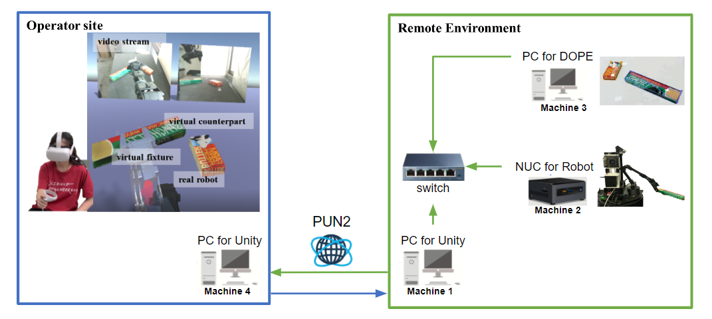
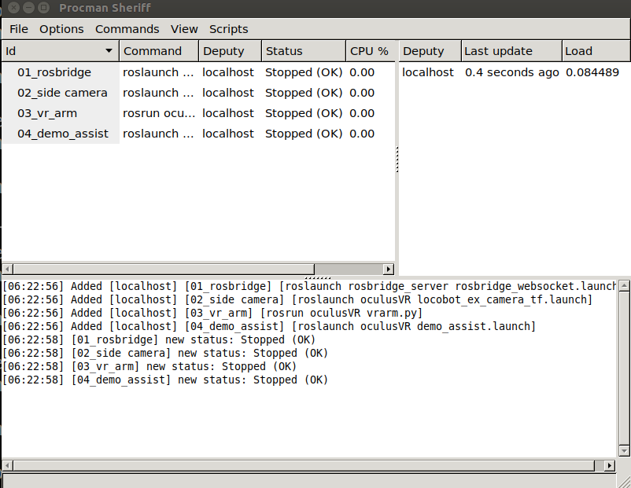

# Local mode :  PUN2 cloud framework with VR-3DO mode

## Application : 
If you would like to setup internet connection between two site by using PUN and using pose-estimation method to update the target object pose.

## Hardware and Network setup


Operator site : 
- [Machine 4] one PC for running unity (Windows OS) (connected to internet)

Remote site : 
- [Machine 1] one PC for running unity (Windows OS) (connected to internet) (IP Address: 10.42.0.3)
- [Machine 2] one NUC for robot control (Ubuntu) (IP Address: 10.42.0.2 - ros master)
- [Machine 3] one PC for running DOPE (Ubuntu) (IP Address: 10.42.0.5)


Network setup
1. Get PUN App ID and region of the server
- ID : 0fbeb5f2-xxxx-xxxx-xxxx-3c50ed985759
- dev region : jp
2. Setup PUN information in PC whose running unity in both site (Machine 1, Machine 4)


## Usage

### Machine 1 : Remote site : Unity setting 

#### Step1. Goto the scene (Global with video-streaming)

#### Step2. Goto Game Manager > UpdatedIP
- Assign which object needed to update the ros_ip
    - Default setting : 
        - Robot Connector (real) Robot Connector (human) + 
        - Camera view_1 
        - Camera view_2 (if you have)
- update the ip address with you ros_master_ip address

### Machine 2 : Remote site : ROS setting 
Remind : 

- suggest run the script for vr script and locobot script separately because of different workspace.
- unplug another D435-camera first if you have one because due to the original script will launch a D435-camera (pyrobot)

#### 1. Clone repo

```bash
mkdir -p ~/catkin_ws/src
cd ~/catkin_ws/src
git clone git@github.com:ARG-NCTU/WFH_locobot.git
```

####  2. Pull Docker

``` bash
docker pull yimlaisum2014/locobot:NUC-vr-py2
```
#### 3. Enter Docker
```
NUC $ cd WFH_locobot/Docker/NUC/vr
NUC $ source docker_run.sh
```

#### 4. Start locobot

```bash
Docker $ cd WFH_locobot/
Docker $ source set_ip.sh
Docker $ source run_locobot.sh
```

#### 5. Start WFH-VE procman
```bash
Docker $ cd WFH_locobot/
Docker $ source set_wfh_workspace_env.sh
Docker $ source start_vr.sh
```

### Procman


What script needed to launch :
- ros_core
- robridge
- vr_arm
- *side_camera (if you have extra D435 camera)

### Machine 3 : Remote site : DOPE setting

1. Clone repo

```bash
mkdir -p ~/catkin_ws/src
cd ~/catkin_ws/src
git clone https://github.com/yimlaisum2014/Deep-Object-Pose.git dope
cd dope/
git checkout devel-exp
```

2. Pull Docker

``` bash
docker pull yimlaisum2014/dope:gpu-noetic
```

3. Enter Docker and make&source workspace

```bash
source docker_run.sh
cd /home/catkin_ws/
catkin_make
source devel/setup.bash
```

4. Launch Dope

Put weight in the ~/catkin_ws/src/dope
```bash
roslaunch dope dope.launch
```


### Machine 4 : Operator site : Unity setting 

#### 1. Goto the scene (Global with video-streaming)
Remind : 

- start before the remote site's Unity

