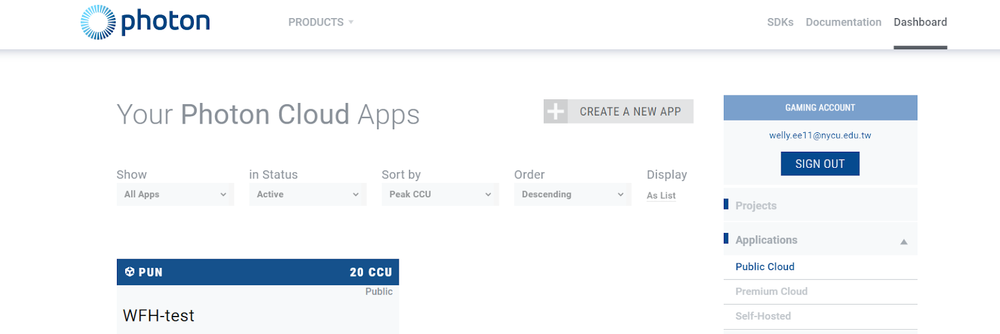
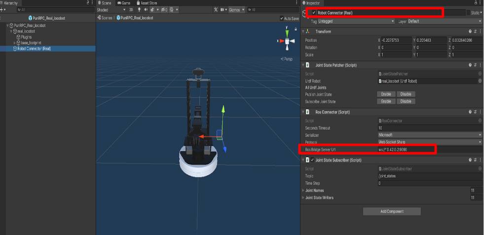
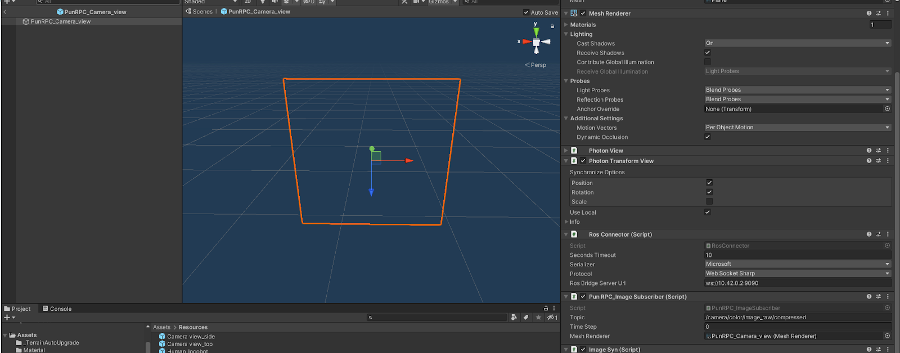
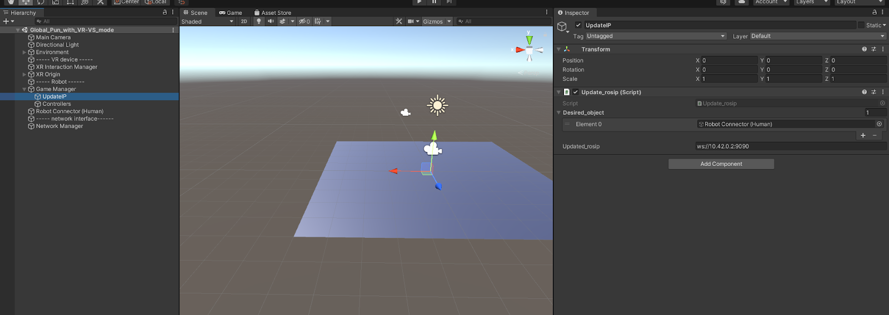

# Local mode : PUN2 cloud framework with VR-VS mode 

## Application : 
If you would like to setup internet connection between two site by using PUN. And you would like to obserate the remote enviroenment by using image streaming.

## Hardware and Network setup


Operator site : 
- [Machine 4] one PC for running unity (Windows OS) (connected to internet)

Remote site : 
- [Machine 1] one PC for running unity (Windows OS) (connected to internet) (IP Address: 10.42.0.3)
- [Machine 2] one NUC for robot control (Ubuntu) (IP Address: 10.42.0.2 - ros master)


Network setup
1. Get PUN App ID



2. Choose region of the server (E.g jp,us)

3. Setup PUN information in PC whose running unity in both site (Machine 1, Machine 4)
- ID : 0fbeb5f2-xxxx-xxxx-xxxx-3c50ed985759
- dev region : jp


## Usage

Procedure : 

1. Set Machine 2 
2. Set Machine 4 
3. Set Machine 1 


### Machine 1 : Remote site : Unity setting 

#### 1. Goto the scene (Global with video-streaming)

#### 2. Set ip
1. Resource > Pun_RPC_Real_locobot



2. Resource > Pun_RPC_Camera_view



3. Goto Game Manager > UpdatedIP
    - assign Robot Connector(Human)
    - change ROS_IP



4. Robot Connector (Human)


#### 3. Start Unity
- You should start the Machine 4 First
- Once you saw the operator's locobot (transparents) appear, assign the human locobot to the Robot Connector (Human) > Joint State Paatcher > Urdf Robot and press enable to publish Joint state

### Machine 2 : Remote site : ROS setting 
Remind : 

- suggest run the script for vr script and locobot script separately because of different workspace.
- unplug another D435-camera first if you have one because due to the original script will launch a D435-camera (pyrobot)

#### 1. Clone repo

```bash
mkdir -p ~/catkin_ws/src
cd ~/catkin_ws/src
git clone git@github.com:ARG-NCTU/WFH_locobot.git
```

####  2. Pull Docker

``` bash
docker pull yimlaisum2014/locobot:NUC-vr-py2
```
#### 3. Enter Docker
```
NUC $ cd WFH_locobot/Docker/NUC/video_streaming
NUC $ source docker_run.sh
```

#### 4. Start locobot

```bash
Docker $ cd WFH_locobot/
Docker $ source set_ip.sh
Docker $ source run_locobot.sh
```

#### 5. Start WFH-VE procman
```bash
Docker $ cd WFH_locobot/
Docker $ source set_wfh_workspace_env.sh
Docker $ source start_vr.sh
```

### Procman


What script needed to launch :
- ros_core
- robridge
- vr_arm
- *side_camera (if you have extra D435 camera)

### Machine 4 : Operator site : Unity setting 

#### 1. Goto the scene (Global with video-streaming)
Remind : 

- start before the remote site's Unity


