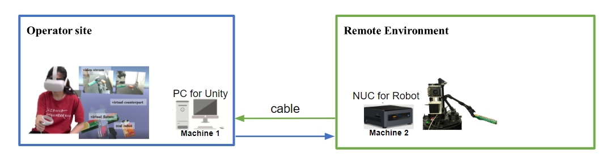

# Local mode : wired ethernet connection with VR-VS mode 

## Application : 
You want to set up the local network, in which your operator site and remote site are under the same domain network, connected by wired ethernet or wifi. And you would like to obserate the remote enviroenment by using image streaming.

## Hardware and Network setup


Operator site : 
- [Machine 1] one PC for running unity (Windows OS) (IP Address: 10.42.0.3)

Remote site : 
- [Machine 2] one NUC for robot control (Ubuntu) (IP Address: 10.42.0.2 - ros master)


## Usage

### Machine 1 : Operator site : Unity setting

#### 1. Goto the scene (Local with video-streaming)

#### 2. Goto Game Manager > UpdatedIP
- Assign which object needed to update the ros_ip
    - Default setting : 
        - Robot Connector (real) Robot Connector (human) + 
        - Camera view_1 
        - Camera view_2 (if you have)
- update the ip address with you ros_master_ip address

### Machine2 : Remote site : ROS setting
Remind : 

- Suggest run the script for vr script and locobot script separately because of different workspace.
- Unplug another D435-camera first if you have one because due to the original script will launch a D435-camera (pyrobot)

#### 1. Clone repo

```bash
mkdir -p ~/catkin_ws/src
cd ~/catkin_ws/src
git clone git@github.com:ARG-NCTU/WFH_locobot.git
```

####  2. Pull Docker

``` bash
docker pull yimlaisum2014/locobot:NUC-vr-py2
```
#### 3. Enter Docker
```
NUC $ cd WFH_locobot/Docker/NUC/video_streaming
NUC $ source docker_run.sh
```

#### 4. Start locobot

```bash
Docker $ cd WFH_locobot/
Docker $ source set_ip.sh
Docker $ source run_locobot.sh
```

#### 5. Start WFH-VE procman
```bash
Docker $ cd WFH_locobot/
Docker $ source catkin_make_py2.sh
Docker $ source set_wfh_workspace_env.sh
Docker $ source start_vr.sh
```

### Procman


What script needed to launch :
- ros_core
- robridge
- vr_arm
- *side_camera (if you have extra D435 camera)


