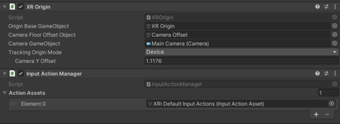
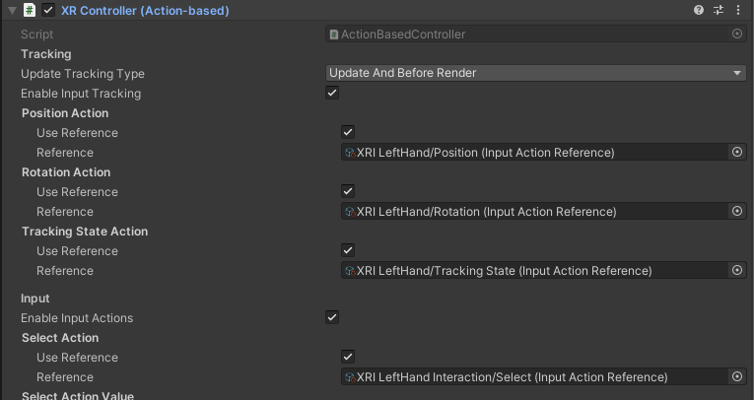

# Setup Up VR devices
This project are using Oculus quest 2

## Step 1 : Download and import some packages
1. Oculus XR Plugin
Goto Edit > Project Settings > XR Plug-in Management, set the oculus 

2. XR interaction Toolkit [Link]
Import starter Assets

## Step 2. Create and set XR GameObject : XR Origin(VR)

