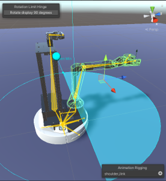
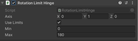
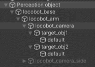
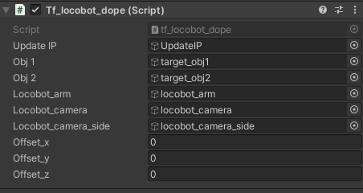
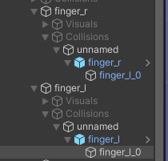
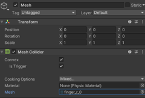
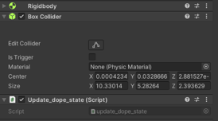

# Setup LoCoBot in Unity

## Step 1 : Clone and import RosSharp
1. Clone from this repo : https://github.com/yimlaisum2014/RosSharp
2. Copy RosSharp folder into your_unity_project/Assets

## Step 2 : Download the Models fils
1. Download models from this link : https://drive.google.com/drive/folders/1VtrLZjnYfBKpE9FhfTslm6xBK4-rLc2v?usp=share_link
2. Copy the models folder into your_unity_project/Assets

## Step 3 : Import robot URDF

## Step 4 : Different GameObject setting

### Real_locobot

Purpose : subscribe the joint state from the remote site robot

- Assist the joint_state_writer to each joint 

### Human_locobot

Purpose : publishing the control command by the opertor in form of joint state of virtual robot arm

1. Add joint_state_reader and joint_state_writer to each joint
2. IK-solver setting
    - Final-ik : FABRIK : translation
        - Add constraint rotation_limit_hinge in shoulder_link to limit  should 1-axis rotation
        
        
    - Animation Rigging : Chain IK : rotation
        - Bone Renderer
        - Set Rig Builder
        - Set Rig ( children of the builder)
3. Publish to the remote site
    - Set the grip_button_function(trigger to publisher script) set bool to publish joint_state

### Game Manager

Purpose : manage global setting used in this project, such as vr hand-controller and rosip setting

- Get the vr-controller value
- Update the ros_ip setting

### Perception object

Purpose : vitual counterpart which updated the pose by using pose-estimation method(DOPE) and streaming image

#### Vitual counterpart by DOPE
- Update pose
    1. create tf Hierarchy as same as the locobot hierarchy for subscribe tf_locobot_dope
    2. create a empty game_object under locobot_camera and named target_objx
    3. import target object mesh/copy prefab’s game object containing mesh under the target_objx

    
    

- Visual aids
    - Robot side :
        1. add collisions on the gripper_r and gripper_l in the fake locobot 
        2. add the mesh : finger_r_0 and finger_l_0 to the mesh collider within the mesh game object

        
        

    - Object side : (for each target object)
        1. Add Rigidbody and Box collider to the target_obj1’s children which containing mesh
        2. Add update_dope_state script

        
        

#### Image stream

- subscribe image from ROS

    1. create empty game object and named camera view
    2. add Mesh filter and choose place
    3. rescale the plane to proper size
    4. add mesh renderer with default-material
    5. add image subscriber (fill in the correct topic name and ros_ip

    

